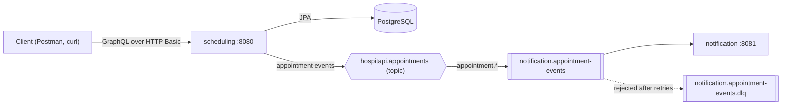
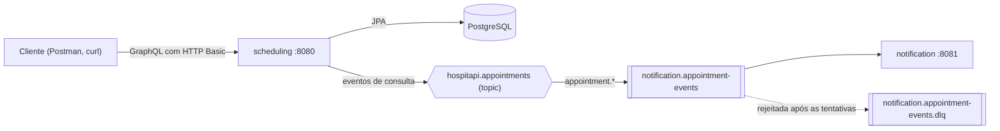

# hospitapi — Hospital Scheduling API

- [🇨🇦 English Description](#english-description)
- [🇧🇷 Descrição em Português](#descrição-em-português)

---

## 🇨🇦English Description

Backend developed for the **Tech Challenge — Phase 03** of the FIAP PosTech Java Architecture & Development program.
The challenge proposes a hospital system that schedules appointments, keeps each patient's appointment history, and
sends automatic reminders so patients show up. Doctors, nurses and patients use the same API with different
permissions.

The solution is split into two Spring Boot services that talk asynchronously through RabbitMQ:

- **scheduling** — authenticates users, creates and edits appointments, serves appointment history through GraphQL,
  and decides when a reminder is due.
- **notification** — consumes appointment events and delivers reminders to patients.

## Stack

- Java 21
- Spring Boot 4.1.1 (Security, GraphQL, Data JPA, AMQP, Actuator)
- PostgreSQL 18 with Flyway migrations
- RabbitMQ 4
- Lombok
- Maven (one wrapper per service)
- JUnit 6 + Testcontainers
- Docker / Docker Compose

## Architecture



### Services

| Service        | Responsibilities                                                                                       | Storage    |
|----------------|--------------------------------------------------------------------------------------------------------|------------|
| `scheduling`   | HTTP Basic authentication, authorization, GraphQL API, appointment history, 24-hour reminder job       | PostgreSQL |
| `notification` | Consumes appointment events and sends reminders through a `ReminderSender` port (logs in this version) | none       |

The brief lists a separate history service as optional. It was not built: history is served by the `scheduling`
GraphQL API, which already owns the appointment data.

### Asynchronous flow

1. A doctor or nurse creates or updates an appointment. After the database transaction commits, `scheduling`
   publishes a `CREATED` or `UPDATED` event to the `hospitapi.appointments` topic exchange, with routing key
   `appointment.created` or `appointment.updated`. Publishing after commit
   means no event is ever sent for a change that was rolled back.
2. The reminder job in `scheduling` runs at startup and then 5 minutes after each run finishes. It finds
   `SCHEDULED` appointments starting within the next 24 hours that have not been reminded yet, publishes a
   `REMINDER_DUE` event (routing key `appointment.reminder-due`) for each one, and records `reminderSentAt`.
3. `notification` consumes every event from its queue and sends the patient a message through `ReminderSender`.
   The current adapter writes the reminder to the log; an email or SMS adapter could replace it without touching the
   consumer.
4. A message that fails is retried twice with exponential backoff (1 s, then 2 s). If it still fails, it goes to the
   dead-letter queue `notification.appointment-events.dlq` instead of being lost.

Events carry only what a reminder needs: event id and type, appointment id and status, patient name and email,
scheduled time, and the time of the event. **Clinical notes are never sent over the broker.**

Each service keeps its own copy of the event record; the JSON message is the contract between them, so neither
service depends on the other's code.

### Package layout

Packages live under `com.vitorbetmann.hospitapi.<service>`:

```
scheduling/
  api/          GraphQL controllers (they only delegate)
  service/      business rules and authorization
  domain/       entities and enums
  repository/   Spring Data JPA
  security/     user lookup for Spring Security
  config/       Spring configuration (Clock, security, messaging)
  messaging/    event record and publishing

notification/
  config/       messaging topology and JSON converter
  messaging/    event record and listener
  reminder/     ReminderSender port and its logging adapter
```

## How to run

The whole system is dockerized. The only requirement is Docker with Docker Compose.

### Start everything

```bash
docker compose up --build
```

This starts four containers, in order:

- `postgres` — PostgreSQL with a persistent volume (`pgdata`)
- `rabbitmq` — RabbitMQ with the management UI at `http://localhost:15672` (user `hospitapi`, password `hospitapi`)
- `notification` — starts once RabbitMQ is healthy, exposed at `http://localhost:8081`
- `scheduling` — starts once PostgreSQL, RabbitMQ and `notification` are healthy, exposed at `http://localhost:8080`

`scheduling` waits for `notification` because `notification` declares the queue, and the reminder job runs as soon
as `scheduling` starts. On a fresh broker, an event published before the queue exists would be discarded.

Flyway creates the schema and loads the demo data on the first start.

To watch reminders arrive:

```bash
docker compose logs -f notification
```

To stop, run `docker compose down`. To also erase the data, run `docker compose down -v`. The demo appointments are
scheduled relative to the first start, so this is also how to refresh them.

### Development mode

To run the services from source instead, start only the infrastructure and run each service from its own folder:

```bash
docker compose up -d postgres rabbitmq
cd notification && ./mvnw spring-boot:run    # in one terminal
cd scheduling && ./mvnw spring-boot:run      # in another
```

On Windows, use `mvnw.cmd`. On a fresh RabbitMQ volume, start `notification` first, for the same reason as above.
Ports 8080 and 8081 can only be held by one copy of each service, so if the app containers are running, stop them
first with `docker compose stop scheduling notification`.

### Tests

```bash
cd scheduling && ./mvnw test
cd notification && ./mvnw test
```

Tests need Docker running: Testcontainers starts disposable PostgreSQL and RabbitMQ containers. The Docker images
build with `-DskipTests`, because Testcontainers cannot run inside `docker build`.

## Demo credentials

Seeded by `scheduling/src/main/resources/db/migration/V2__seed_data.sql`. These are demo accounts for reviewers;
the database holds no real patient data.

| Username  | Password     | Role    | Linked patient |
|-----------|--------------|---------|----------------|
| `doctor`  | `doctor123`  | DOCTOR  | —              |
| `nurse`   | `nurse123`   | NURSE   | —              |
| `patient` | `patient123` | PATIENT | 1 — Ana Souza  |

Passwords are stored as bcrypt hashes.

## Access rules

| Operation               | DOCTOR | NURSE | PATIENT     |
|-------------------------|--------|-------|-------------|
| `appointment`           | ✅     | ✅    | own only    |
| `appointmentsByPatient` | ✅     | ✅    | own id only |
| `createAppointment`     | ✅     | ✅    | ❌          |
| `updateAppointment`     | ✅     | ✅    | ❌          |
| `updateClinicalNotes`   | ✅     | ❌    | ❌          |

**How the brief was interpreted.** The brief says doctors "view and edit the appointment history", nurses "register
appointments and access the history", and, in a later section, that both doctors and nurses may create and modify
appointments. These statements overlap, so this project reads them as follows:

- Scheduling (creating, rescheduling, changing status) is shared by doctors and nurses.
- "Editing the history" means writing clinical notes, which only doctors can do, through a dedicated
  `updateClinicalNotes` mutation. `updateAppointment` cannot change notes.
- Patients can only read their own appointments.

**Where the rules are enforced.** All authorization lives in the service layer: `@PreAuthorize` checks the role, and
a programmatic check makes sure a patient only reaches their own data. GraphQL controllers only delegate, so every
future entry point gets the same rules.

**How a denial looks.** Requests without valid credentials are rejected by the Spring Security filter chain with
HTTP `401`. An authenticated user asking for something they may not do gets a GraphQL error instead: HTTP `200` with
the classification `FORBIDDEN` and no data.

```json
{
  "errors": [
    {
      "message": "Forbidden",
      "path": [
        "updateClinicalNotes"
      ],
      "extensions": {
        "classification": "FORBIDDEN"
      }
    }
  ],
  "data": {
    "updateClinicalNotes": null
  }
}
```

## GraphQL API

Everything goes through a single endpoint, `POST http://localhost:8080/graphql`, with HTTP Basic authentication.
The schema is in `scheduling/src/main/resources/graphql/`.

| Type     | Operation                                      | Description                                                                                        |
|----------|------------------------------------------------|----------------------------------------------------------------------------------------------------|
| Query    | `appointment(id)`                              | One appointment; `NOT_FOUND` if the id does not exist                                              |
| Query    | `appointmentsByPatient(patientId, onlyFuture)` | A patient's appointments, soonest first; optionally only future ones                               |
| Mutation | `createAppointment(input)`                     | Schedules a new appointment with status `SCHEDULED`                                                |
| Mutation | `updateAppointment(id, input)`                 | Changes doctor, time, status or reason of a `SCHEDULED` appointment; omitted fields stay unchanged |
| Mutation | `updateClinicalNotes(id, notes)`               | Replaces the clinical notes                                                                        |

Timestamps use the RFC 3339 `DateTime` scalar, for example `2026-10-01T14:00:00-03:00`.

### Example — create an appointment

```graphql
mutation {
    createAppointment(input: {
        patientId: 1
        doctorId: 1
        scheduledAt: "2026-10-01T14:00:00-03:00"
        reason: "Annual check-up"
    }) {
        id
        status
        scheduledAt
        doctor { name }
    }
}
```

The same request with curl (macOS/Linux shell quoting):

```bash
curl -u nurse:nurse123 -H "Content-Type: application/json" \
  -d '{"query":"mutation { createAppointment(input: {patientId: 1, doctorId: 1, scheduledAt: \"2026-10-01T14:00:00-03:00\", reason: \"Annual check-up\"}) { id status scheduledAt } }"}' \
  http://localhost:8080/graphql
```

### Example — upcoming appointments of a patient

```graphql
query {
    appointmentsByPatient(patientId: 1, onlyFuture: true) {
        id
        scheduledAt
        status
        reason
        doctor { name }
    }
}
```

## Data model

Flyway owns the schema (`scheduling/src/main/resources/db/migration`); Hibernate only validates it.

- `patients` — `id`, `name`, `email`, `phone`
- `users` — `id`, `username`, `password_hash`, `name`, `role` (`DOCTOR`, `NURSE`, `PATIENT`), `patient_id`
  (set only for `PATIENT` users). Doctors are users with role `DOCTOR`.
- `appointments` — `id`, `patient_id`, `doctor_id`, `scheduled_at`, `status` (`SCHEDULED`, `COMPLETED`,
  `CANCELLED`), `reason`, `notes`, `reminder_sent_at`, `created_at`, `updated_at`

The seed data contains two patients (Ana Souza and Bruno Lima), the three demo users, and three appointments: one
upcoming and one past for Ana, and one for Bruno within the next 24 hours, which gets a reminder as soon as `scheduling`
starts.

## Health checks

| URL                                     | Details shown               |
|-----------------------------------------|-----------------------------|
| `http://localhost:8081/actuator/health` | always                      |
| `http://localhost:8080/actuator/health` | only to authenticated users |

`notification` has no Spring Security, and its health details are the quickest way to check the broker connection.
`scheduling` is secured, so it hides database and broker details from anonymous callers.

## Postman collection

The collection is in [`postman/hospitapi.postman_collection.json`](postman/hospitapi.postman_collection.json).
Import it, start the stack, and run it top to bottom with the Collection Runner: later requests reuse ids saved by
earlier ones. Every request includes tests.

- **Health & filter chain** — health endpoints, requests without credentials or with a wrong password (`401`)
- **Nurse** — create, reschedule, fetch and list appointments; denied when editing clinical notes
- **Doctor** — edit clinical notes, list full history, cancel an appointment
- **Patient** — list and fetch own appointments; denied on other patients' data and on every mutation
- **Error handling** — unknown appointment id, `doctorId` that is not a doctor

One request creates an appointment two hours ahead, so its reminder appears in `docker compose logs -f notification`
within five minutes.

The collection can also be opened directly in Postman
[here](https://vitorbetmann-5356326.postman.co/workspace/Vitor-Betmann's-Workspace~88c6f948-7512-4287-86ff-a0109b20c44c/collection/49832651-352775a1-d07c-4bea-97e1-21ec124cec40?action=share&source=copy-link&creator=49832651).

## Design decisions and trade-offs

Each decision is recorded with its alternatives in [`docs/decisions.md`](docs/decisions.md). The main ones:

- **The reminder job runs in `scheduling`, not in `notification`.** `scheduling` owns the appointment data, so it
  decides when a reminder is due. `notification` stays stateless: no database, and it can be scaled or replaced
  freely.
- **Events are published after commit.** A rolled-back change never produces an event. The trade-off: if the
  service crashes between commit and publish, that event is lost. A transactional outbox would close the gap, at the
  cost of more infrastructure than this project needs.
- **HTTP Basic, stateless.** Simple to test, and it matches the brief's call for basic authentication. Credentials
  travel with every request, so
  production use would require HTTPS or a token-based scheme.
- **No optimistic locking.** Concurrent edits to the same appointment follow last-write-wins.
- **Reminders are logged.** `ReminderSender` is a port, so a real email or SMS adapter is a new class, not a change
  to the consumer.

---

## 🇧🇷Descrição em Português

Backend desenvolvido para o **Tech Challenge — Fase 03** da pós-graduação FIAP PosTech em Arquitetura e
Desenvolvimento Java. O desafio propõe um sistema hospitalar que agenda consultas, mantém o histórico de consultas de
cada paciente e envia lembretes automáticos para garantir a presença dos pacientes. Médicos, enfermeiros e pacientes
usam a mesma API, com permissões diferentes.

A solução é dividida em dois serviços Spring Boot que se comunicam de forma assíncrona via RabbitMQ:

- **scheduling** — autentica os usuários, cria e edita consultas, disponibiliza o histórico via GraphQL e decide
  quando um lembrete deve ser enviado.
- **notification** — consome os eventos de consulta e envia os lembretes aos pacientes.

## Stack

- Java 21
- Spring Boot 4.1.1 (Security, GraphQL, Data JPA, AMQP, Actuator)
- PostgreSQL 18 com migrações Flyway
- RabbitMQ 4
- Lombok
- Maven (um wrapper por serviço)
- JUnit 6 + Testcontainers
- Docker / Docker Compose

## Arquitetura



### Serviços

| Serviço        | Responsabilidades                                                                                       | Armazenamento |
|----------------|---------------------------------------------------------------------------------------------------------|---------------|
| `scheduling`   | Autenticação HTTP Basic, autorização, API GraphQL, histórico de consultas, job de lembretes de 24 horas | PostgreSQL    |
| `notification` | Consome os eventos de consulta e envia lembretes pela porta `ReminderSender` (nesta versão, em log)     | nenhum        |

O enunciado lista um serviço de histórico separado como opcional. Ele não foi construído: o histórico é servido pela
API GraphQL do `scheduling`, que já é dono dos dados das consultas.

### Fluxo assíncrono

1. Um médico ou enfermeiro cria ou altera uma consulta. Depois que a transação no banco é confirmada (commit), o
   `scheduling` publica um evento `CREATED` ou `UPDATED` na exchange topic `hospitapi.appointments`, com routing key
   `appointment.created` ou `appointment.updated`. Publicar após o commit garante que nenhum evento seja enviado para
   uma alteração que sofreu rollback.
2. O job de lembretes do `scheduling` roda na inicialização e depois 5 minutos após o término de cada execução. Ele
   busca consultas `SCHEDULED` que começam nas próximas 24 horas e ainda não foram lembradas, publica um evento
   `REMINDER_DUE` (routing key `appointment.reminder-due`) para cada uma e registra `reminderSentAt`.
3. O `notification` consome todos os eventos da sua fila e envia a mensagem ao paciente via `ReminderSender`.
   O adaptador atual grava o lembrete no log; um adaptador de e-mail ou SMS poderia substituí-lo sem alterar o
   consumidor.
4. Uma mensagem que falha é reprocessada mais duas vezes, com backoff exponencial (1 s e depois 2 s). Se ainda
   falhar, vai para a dead-letter queue `notification.appointment-events.dlq` em vez de ser perdida.

Os eventos levam apenas o que um lembrete precisa: id e tipo do evento, id e status da consulta, nome e e-mail do
paciente, horário agendado e horário do evento. **As notas clínicas nunca trafegam pelo broker.**

Cada serviço mantém sua própria cópia do record do evento; a mensagem JSON é o contrato entre eles, e nenhum serviço
depende do código do outro.

### Estrutura de pacotes

Os pacotes ficam em `com.vitorbetmann.hospitapi.<serviço>`:

```
scheduling/
  api/          controllers GraphQL (apenas delegam)
  service/      regras de negócio e autorização
  domain/       entidades e enums
  repository/   Spring Data JPA
  security/     busca de usuários para o Spring Security
  config/       configuração Spring (Clock, segurança, mensageria)
  messaging/    record do evento e publicação

notification/
  config/       topologia de mensageria e conversor JSON
  messaging/    record do evento e listener
  reminder/     porta ReminderSender e seu adaptador de log
```

## Como executar

O sistema inteiro é dockerizado. O único requisito é o Docker com Docker Compose.

### Subir tudo

```bash
docker compose up --build
```

Isso sobe quatro containers, nesta ordem:

- `postgres` — PostgreSQL com volume persistente (`pgdata`)
- `rabbitmq` — RabbitMQ com a interface de gerenciamento em `http://localhost:15672` (usuário `hospitapi`, senha
  `hospitapi`)
- `notification` — inicia quando o RabbitMQ está saudável, exposto em `http://localhost:8081`
- `scheduling` — inicia quando PostgreSQL, RabbitMQ e `notification` estão saudáveis, exposto em
  `http://localhost:8080`

O `scheduling` espera o `notification` porque é o `notification` que declara a fila, e o job de lembretes roda assim
que o `scheduling` inicia. Em um broker recém-criado, um evento publicado antes de a fila existir seria descartado.

O Flyway cria o schema e carrega os dados de demonstração na primeira inicialização.

Para acompanhar os lembretes:

```bash
docker compose logs -f notification
```

Para parar, use `docker compose down`. Para apagar também os dados, use `docker compose down -v`. As consultas de
demonstração são agendadas em relação à primeira inicialização, então essa também é a forma de renová-las.

### Modo de desenvolvimento

Para rodar os serviços a partir do código-fonte, suba apenas a infraestrutura e execute cada serviço na sua pasta:

```bash
docker compose up -d postgres rabbitmq
cd notification && ./mvnw spring-boot:run    # em um terminal
cd scheduling && ./mvnw spring-boot:run      # em outro
```

No Windows, use `mvnw.cmd`. Com um volume do RabbitMQ recém-criado, inicie o `notification` primeiro, pelo mesmo
motivo explicado acima. As portas 8080 e 8081 só podem ser usadas por uma cópia de cada serviço; se os containers da
aplicação estiverem rodando, pare-os antes com `docker compose stop scheduling notification`.

### Testes

```bash
cd scheduling && ./mvnw test
cd notification && ./mvnw test
```

Os testes precisam do Docker em execução: o Testcontainers sobe containers descartáveis de PostgreSQL e RabbitMQ. As
imagens Docker são construídas com `-DskipTests`, porque o Testcontainers não roda dentro de `docker build`.

## Credenciais de demonstração

Criadas por `scheduling/src/main/resources/db/migration/V2__seed_data.sql`. São contas de demonstração para os
avaliadores; o banco não contém dados reais de pacientes.

| Usuário   | Senha        | Perfil  | Paciente vinculado |
|-----------|--------------|---------|--------------------|
| `doctor`  | `doctor123`  | DOCTOR  | —                  |
| `nurse`   | `nurse123`   | NURSE   | —                  |
| `patient` | `patient123` | PATIENT | 1 — Ana Souza      |

As senhas são armazenadas como hashes bcrypt.

## Regras de acesso

| Operação                | DOCTOR | NURSE | PATIENT             |
|-------------------------|--------|-------|---------------------|
| `appointment`           | ✅     | ✅    | apenas as próprias  |
| `appointmentsByPatient` | ✅     | ✅    | apenas o próprio id |
| `createAppointment`     | ✅     | ✅    | ❌                  |
| `updateAppointment`     | ✅     | ✅    | ❌                  |
| `updateClinicalNotes`   | ✅     | ❌    | ❌                  |

**Como o enunciado foi interpretado.** O enunciado diz que médicos "podem visualizar e editar o histórico de
consultas", que enfermeiros "podem registrar consultas e acessar o histórico" e, em outra seção, que médicos e
enfermeiros podem registrar e modificar consultas. Essas afirmações se sobrepõem, então este projeto as lê assim:

- O agendamento (criar, reagendar, mudar o status) é compartilhado entre médicos e enfermeiros.
- "Editar o histórico" significa escrever as notas clínicas, o que só médicos podem fazer, pela mutation dedicada
  `updateClinicalNotes`. A `updateAppointment` não altera notas.
- Pacientes só podem ler as próprias consultas.

**Onde as regras são aplicadas.** Toda a autorização fica na camada de serviço: `@PreAuthorize` verifica o perfil, e
uma verificação programática garante que um paciente só acesse os próprios dados. Os controllers GraphQL apenas
delegam, então qualquer novo ponto de entrada recebe as mesmas regras.

**Como uma negação aparece.** Requisições sem credenciais válidas são rejeitadas pela cadeia de filtros do Spring
Security com HTTP `401`. Um usuário autenticado que pede algo que não pode fazer recebe um erro GraphQL: HTTP `200`
com a classificação `FORBIDDEN` e sem dados.

```json
{
  "errors": [
    {
      "message": "Forbidden",
      "path": [
        "updateClinicalNotes"
      ],
      "extensions": {
        "classification": "FORBIDDEN"
      }
    }
  ],
  "data": {
    "updateClinicalNotes": null
  }
}
```

## API GraphQL

Tudo passa por um único endpoint, `POST http://localhost:8080/graphql`, com autenticação HTTP Basic. O schema está em
`scheduling/src/main/resources/graphql/`.

| Tipo     | Operação                                       | Descrição                                                                                       |
|----------|------------------------------------------------|-------------------------------------------------------------------------------------------------|
| Query    | `appointment(id)`                              | Uma consulta; `NOT_FOUND` se o id não existir                                                   |
| Query    | `appointmentsByPatient(patientId, onlyFuture)` | Consultas de um paciente, da mais próxima para a mais distante; opcionalmente só as futuras     |
| Mutation | `createAppointment(input)`                     | Agenda uma nova consulta com status `SCHEDULED`                                                 |
| Mutation | `updateAppointment(id, input)`                 | Altera médico, horário, status ou motivo de uma consulta `SCHEDULED`; campos omitidos não mudam |
| Mutation | `updateClinicalNotes(id, notes)`               | Substitui as notas clínicas                                                                     |

Datas e horários usam o scalar `DateTime` (RFC 3339), por exemplo `2026-10-01T14:00:00-03:00`.

### Exemplo — criar uma consulta

```graphql
mutation {
    createAppointment(input: {
        patientId: 1
        doctorId: 1
        scheduledAt: "2026-10-01T14:00:00-03:00"
        reason: "Annual check-up"
    }) {
        id
        status
        scheduledAt
        doctor { name }
    }
}
```

A mesma requisição com curl (aspas no padrão de shells macOS/Linux):

```bash
curl -u nurse:nurse123 -H "Content-Type: application/json" \
  -d '{"query":"mutation { createAppointment(input: {patientId: 1, doctorId: 1, scheduledAt: \"2026-10-01T14:00:00-03:00\", reason: \"Annual check-up\"}) { id status scheduledAt } }"}' \
  http://localhost:8080/graphql
```

### Exemplo — próximas consultas de um paciente

```graphql
query {
    appointmentsByPatient(patientId: 1, onlyFuture: true) {
        id
        scheduledAt
        status
        reason
        doctor { name }
    }
}
```

## Modelo de dados

O Flyway é dono do schema (`scheduling/src/main/resources/db/migration`); o Hibernate apenas o valida.

- `patients` — `id`, `name`, `email`, `phone`
- `users` — `id`, `username`, `password_hash`, `name`, `role` (`DOCTOR`, `NURSE`, `PATIENT`), `patient_id`
  (preenchido apenas para usuários `PATIENT`). Médicos são usuários com perfil `DOCTOR`.
- `appointments` — `id`, `patient_id`, `doctor_id`, `scheduled_at`, `status` (`SCHEDULED`, `COMPLETED`,
  `CANCELLED`), `reason`, `notes`, `reminder_sent_at`, `created_at`, `updated_at`

Os dados iniciais contêm dois pacientes (Ana Souza e Bruno Lima), os três usuários de demonstração e três consultas:
uma futura e uma passada para a Ana, e uma para o Bruno nas próximas 24 horas, que recebe um lembrete assim que o
`scheduling` inicia.

## Health checks

| URL                                     | Detalhes exibidos                 |
|-----------------------------------------|-----------------------------------|
| `http://localhost:8081/actuator/health` | sempre                            |
| `http://localhost:8080/actuator/health` | apenas para usuários autenticados |

O `notification` não tem Spring Security, e os detalhes do seu health são a forma mais rápida de verificar a conexão
com o broker. O `scheduling` é protegido, então esconde os detalhes do banco e do broker de chamadas anônimas.

## Coleção Postman

A coleção está em [`postman/hospitapi.postman_collection.json`](postman/hospitapi.postman_collection.json).
Importe-a, suba o ambiente e execute-a de cima para baixo com o Collection Runner: requisições posteriores reutilizam
ids salvos pelas anteriores. Todas as requisições incluem testes.

- **Health & filter chain** — endpoints de health, requisições sem credenciais ou com senha errada (`401`)
- **Nurse** — criar, reagendar, buscar e listar consultas; negado ao editar notas clínicas
- **Doctor** — editar notas clínicas, listar o histórico completo, cancelar uma consulta
- **Patient** — listar e buscar as próprias consultas; negado nos dados de outros pacientes e em todas as mutations
- **Error handling** — id de consulta inexistente, `doctorId` que não é de um médico

Uma das requisições cria uma consulta para daqui a duas horas, então o lembrete dela aparece em
`docker compose logs -f notification` em até cinco minutos.

Também é possível abrir a coleção diretamente no Postman
[aqui](https://vitorbetmann-5356326.postman.co/workspace/Vitor-Betmann's-Workspace~88c6f948-7512-4287-86ff-a0109b20c44c/collection/49832651-352775a1-d07c-4bea-97e1-21ec124cec40?action=share&source=copy-link&creator=49832651).

## Decisões de projeto e trade-offs

Cada decisão está registrada, com as alternativas consideradas, em [`docs/decisions.md`](docs/decisions.md). As
principais:

- **O job de lembretes roda no `scheduling`, não no `notification`.** O `scheduling` é dono dos dados das consultas,
  então é ele quem decide quando um lembrete é devido. O `notification` continua stateless: sem banco, podendo ser
  escalado ou substituído livremente.
- **Eventos são publicados após o commit.** Uma alteração com rollback nunca gera evento. O trade-off: se o serviço
  cair entre o commit e a publicação, aquele evento se perde. Um transactional outbox fecharia essa lacuna, ao custo de
  mais infraestrutura do que este projeto precisa.
- **HTTP Basic, stateless.** Simples de testar e atende à autenticação básica pedida no enunciado. As credenciais vão em
  toda requisição,
  então um uso em produção exigiria HTTPS ou um esquema baseado em tokens.
- **Sem lock otimista.** Edições concorrentes na mesma consulta seguem last-write-wins.
- **Lembretes vão para o log.** `ReminderSender` é uma porta, então um adaptador real de e-mail ou SMS é uma nova
  classe, sem mudanças no consumidor.